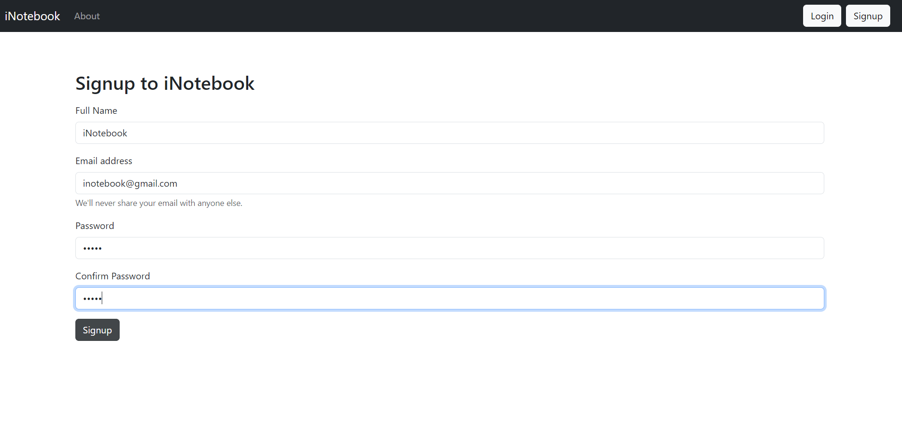

# iNotebook - MERN Note Taking App


Welcome to iNotebook, a full-stack MERN (MongoDB, Express, React, Node.js) web application for taking and managing notes. This app provides user authentication, allowing only registered users to create, read, edit, and delete their notes. Bootstrap has been used for styling to create an intuitive and responsive user interface.

## Table of Contents

- [Introduction](#inotebook---mern-note-taking-app)
- [Features](#features)
- [Screenshots](#screenshots)
- [Installation](#installation)
- [Usage](#usage)
- [Contributing](#contributing)

## Features

- **User Authentication:** Users must create an account and log in to access note-taking functionality.
- **Create Note:** Authenticated users can create new notes with a title, description and tag.
- **Read Note:** Users can view a list of their created notes.
- **Edit Note:** Users can edit the content of their existing notes.
- **Delete Note:** Users have the option to delete notes they've created.
- **Responsive Design:** Bootstrap is used for styling, ensuring a consistent and user-friendly experience across devices.

## Screenshots


_Home Page_


_Sign up_


_Sign in_


_Create Note_


_Create Update_


_Create Update_

## Installation

1. Clone the repository using the following command:

   ```bash
   git clone https://github.com/sadanmian/inotebook.git
   ```

2. Navigate to the project directory:

   ```bash
   cd inotebook
   ```

3. Install server dependencies:

   ```bash
   npm install
   ```

4. Navigate to the client directory:

   ```bash
   cd client
   ```

5. Install client dependencies:

   ```bash
   npm install
   ```

## Usage

1. Start the server:

   ```bash
   npm run server
   ```

2. In a separate terminal, start the client:

   ```bash
   npm run client
   ```

   This will launch the app in your default web browser. You can access it at `http://localhost:3000`.

3. Register an account or log in with an existing account to access note-taking functionality.

4. Create, read, edit, and delete notes as needed.

## Contributing

Contributions are welcome! If you'd like to contribute to this project, please follow the guidelines below:

1. Fork the repository.
2. Create a new branch for your feature or bug fix.
3. Make your changes and test them thoroughly.
4. Commit your changes with clear and concise commit messages.
5. Push your changes to your forked repository.
6. Create a pull request explaining your changes and their purpose.
